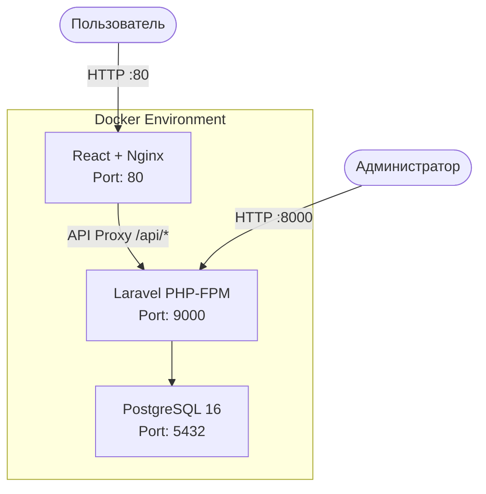

# Scooter Rent - Система управления арендой самокатов


## О проекте

**Scooter Rent** — веб-приложение для управления арендой самокатов. Система позволяет:

- Регистрироваться и аутентифицироваться пользователям
- Управлять парком самокатов (CRUD операции)
- Отслеживать текущие аренды и историю
- Просматривать дашборд с основной статистикой

## Архитектура

Проект построен на микросервисной архитектуре с использованием контейнеризации:



### Компоненты системы

| Компонент | Технология | Порт | Описание |
|-----------|-----------|------|----------|
| Frontend | React + Nginx | 80 | SPA приложение с проксированием API |
| Backend | Laravel + PHP-FPM | 9000 | REST API с аутентификацией |
| Server Nginx | Nginx | 8000 | Прокси для Laravel API |
| Database | PostgreSQL 16 | 5432 | Основное хранилище данных |

## Технологический стек

### Frontend
- **React 19** — библиотека для построения пользовательских интерфейсов
- **TypeScript 4.9** — типизированный JavaScript
- **TailwindCSS 3.4** — utility-first CSS фреймворк
- **React Router 7** — маршрутизация SPA
- **Axios** — HTTP клиент с интерцепторами
- **React Leaflet** — интеграция карт
- **Lucide React** — набор иконок
- **React Hot Toast** — уведомления

### Backend
- **Laravel 13.8** — PHP фреймворк
- **PostgreSQL 16** — реляционная база данных
- **Laravel Sanctum** — аутентификация по токенам
- **PHP 8.3** — язык программирования

### DevOps
- **Docker** — контейнеризация
- **Docker Compose** — оркестрация контейнеров
- **Nginx** — веб-сервер и прокси

## Требования(на другиях версиях тестов не было)

- Docker version 28.2.2, build 28.2.2-0ubuntu1~24.04.1
- docker-compose version 1.29.2, build unknown
- 1 GB свободной RAM
- 5 GB свободного места на диске

## Быстрый старт

### 1. Клонирование репозитория

```bash
git clone https://github.com/your-username/crm-system.git
cd crm-system
```
### 2. Запуск

```bash
docker-compose up -d # Сборка и запуск в фоне
```

```bash
docker exec -it scooter-server php artisan db:seed # Данные о самокатах(опционально)
```

```bash
docker-compose down # Остановка сервисов. Добавить флаг -v для удаления состояния
```

### После запуска(обязательно)

```bash
docker exec -it scooter-server cp .env.example .env  
```

```bash
docker exec -it scooter-server php artisan key:generate --force 
```

### 3. Автоматический запуск

```bash
cd scripts
source start.sh
```
